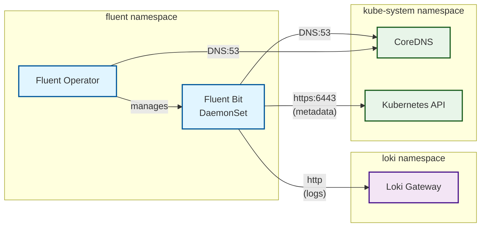

# Fluent Operator Helm chart

[Fluent Operator](https://github.com/fluent/fluent-operator/) provides a Kubernetes-native logging pipeline based on Fluent-Bit and Fluentd.

## Required Secrets

### Loki Credentials

You must create a Kubernetes Secret containing the tenant ID as well as the HTTP basic authentication username and password to connect to Loki. The name of this secret is configurable via the Helm values. Default is "loki-client-credentials".

```yaml
apiVersion: v1
kind: Secret
metadata:
  name: loki-client-credentials
  namespace: "your-namespace"
stringData:
  httpUser: "your-loki-uer"
  httpPassword: "your-loki-password"
  tenantID: "your-tenant-id"
type: Opaque
```

## Network Policies

**Important:** This wrapper chart defines custom NetworkPolicy resources that are **not present in the upstream fluent-operator chart**. These policies are maintained locally to provide granular network security for Fluent Operator deployments.

### Overview

- **Flavors:** Supports both `kubernetes` and `cilium` NetworkPolicy types
- **Configuration:** Set `networkPolicy.enabled: true` and `networkPolicy.flavor: kubernetes` or `cilium`

### Allowed Communication Flows



### Policies Created

#### Egress Policies
- **fluent-egress**: Allows Fluent Bit pods → Loki Gateway (port 8080)
- **fluent-egress-dns**: Allows all Fluent pods → CoreDNS (kube-system:53)
- **fluent-egress-kube-apiserver**: Allows Fluent Bit pods → Kubernetes API server (kube-system:6443, for metadata enrichment)
- **fluent-namespace-only**: Allows all pods to communicate within same namespace

#### Ingress Policies
- **fluent-namespace-only**: Allows all pods to communicate within same namespace

### Configuration

```yaml
networkPolicy:
  enabled: true
  flavor: cilium  # or "kubernetes"
  loki:
    namespace: loki
    port: 8080  # Pod port (container port), not service port!
```

**Note:** Pod selectors are defined in `templates/_helpers.tpl` and match the standard fluent-operator labels:
- Fluent Operator pods: `app.kubernetes.io/name: fluent-operator`
- Fluent Bit pods: `app.kubernetes.io/name: fluent-bit`

**Important:** The `loki.port` must be the **pod/container port** (typically 8080), not the service port (80). Network policies operate at the pod level and see the actual container port.
