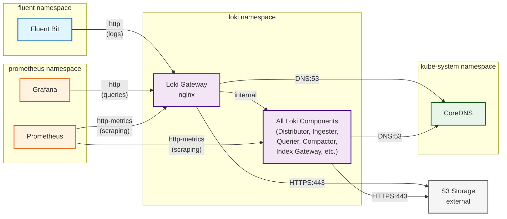

# Loki Helm Chart

Helm chart for Grafana Loki and Grafana Enterprise Logs supporting monolithic, simple scalable, and microservices modes.

## DNS setting

Make sure to configure Loki to use the correct DNS setting for your cluster.
You can check which DNS service you have by running:

```
kubectl get svc --namespace=kube-system -l k8s-app=kube-dns  -o jsonpath='{.items..metadata.name}'
```

```
loki:
  global:
     dnsService: "your-dns-setting-name"
```

## Mandatory Secrets

### Loki Clients Basic Auth

Create a ```.htpasswd``` file

```
htpasswd -bc .htpasswd chorus-fluentbit <chorus-fluentbit-password>
htpasswd -b .htpasswd chorus-grafana  <chorus-grafana-password>
```

Create a Kubernetes secret containing the ```.htpasswd``` file.
You can change the secret name in the Helm chart values.
Default is loki-gateway-htpasswd.

```
kubectl create secret generic loki-gateway-htpasswd -n <namespace> --from-file=.htpasswd
```

The secret should look similar to:

```
apiVersion: v1
data:
  .htpasswd: <base64-encoded-content>
kind: Secret
metadata:
  name: loki-gateway-htpasswd
  namespace: <namespace>
```

Finally, delete your local ```.htpasswd``` file.

```
rm .htpasswd
```

### S3 Credentials

You can change the secret name in the Helm chart values.
Default is loki-s3-credentials.

```yaml
apiVersion: v1
kind: Secret
metadata:
  name: loki-s3-credentials
  namespace: <namespace>
stringData:
  accessKeyId: "my-s3-access-key-id"
  secretAccessKey: "my-s3-secret-access-key"
type: Opaque
```

## Network Policies

**Important:** This wrapper chart defines custom NetworkPolicy resources that are **not present in the upstream Loki chart**. These policies are maintained locally to provide granular network security for Loki deployments.

### Overview

- **Deployment Mode:** Designed for `Distributed` mode only
- **Flavors:** Supports both `kubernetes` and `cilium` NetworkPolicy types
- **Configuration:** Set `networkPolicy.enabled: true` and `networkPolicy.flavor: kubernetes` or `cilium`

### Allowed Communication Flows



### Policies Created

#### Ingress Policies
- **loki-ingress**: Allows Fluent Bit (fluent ns) and Grafana (prometheus ns) → Gateway (http)
- **loki-ingress-metrics**: Allows Prometheus (prometheus ns) → All Loki pods (http-metrics)
- **loki-namespace-only**: Allows all Loki pods to communicate within same namespace

#### Egress Policies
- **loki-egress-dns**: Allows all Loki pods → CoreDNS (kube-system:53)
- **loki-egress-external-storage**: Allows all Loki pods → S3 storage (HTTPS:443)
- **loki-namespace-only**: Allows all Loki pods to communicate within same namespace

### Configuration

```yaml
networkPolicy:
  enabled: true
  flavor: cilium  # or "kubernetes"
  kubePrometheusStack:
    namespace: prometheus
  fluentBit:
    namespace: fluent
  externalStorage:
    cidrs: []  # Add your S3 provider's CIDR ranges here
```
