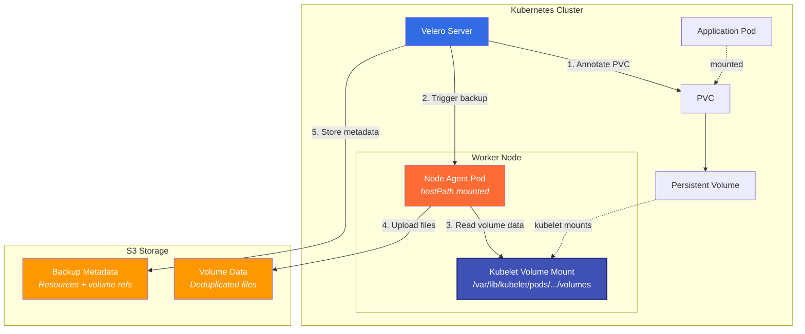
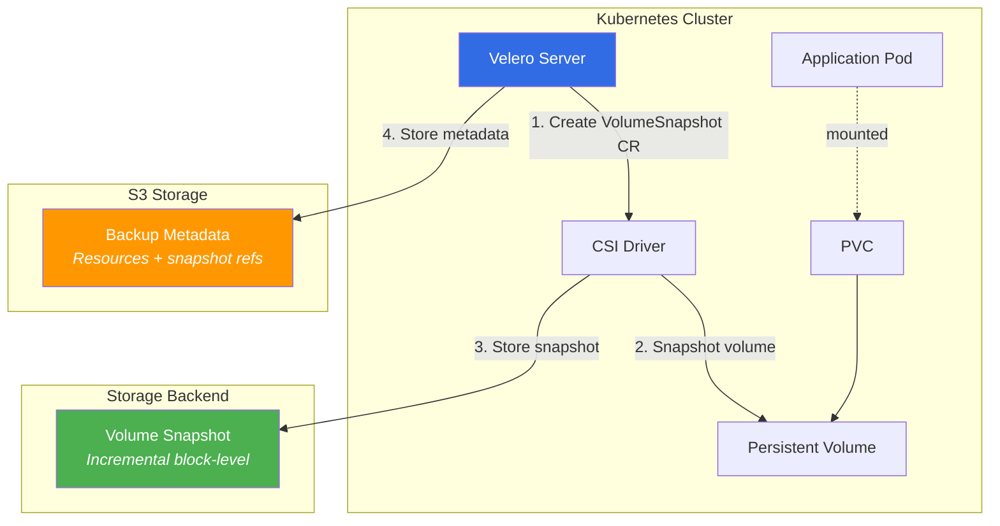

# Velero

Helm chart bundling [vmware-tanzu/velero](https://github.com/vmware-tanzu/velero) for Kubernetes backup and disaster recovery.

## Overview

Velero provides backup, restore, and disaster recovery capabilities for Kubernetes clusters. This wrapper chart configures Velero with sensible defaults for Chorus environments.

## Prerequisites

1. **Object Storage Bucket**: S3-compatible storage (AWS S3, MinIO, GCS, Azure Blob)
2. **Credentials**: Access keys or IAM role for storage access
3. **Velero CLI**: `brew install velero` (for operations)
4. **Kubernetes Access**: kubectl configured with admin permissions

## Mandatory Secrets

### Credentials

You can change the secret name in the Helm chart values.
Default is velero-credentials.

```bash
# Create credentials file
cat > credentials-velero <<EOF
[default]
aws_access_key_id=YOUR_ACCESS_KEY
aws_secret_access_key=YOUR_SECRET_KEY
EOF

# Create Kubernetes secret
kubectl create secret generic velero-credentials \
  --from-file=cloud=credentials-velero \
  --namespace velero

# Clean up local file
rm credentials-velero
```

## Architecture

Velero provides two backup strategies for persistent volumes:

### Strategy 1: Node-Agent File-Level Backup (Default)



**How it works:**
1. Velero annotates PVC for node-agent backup (default behavior)
2. Node-agent pod (daemonset) has hostPath mount to `/var/lib/kubelet/pods`
3. Node-agent accesses the volume's data files **directly from the node filesystem** (same files the application pod sees)
4. Kopia reads files, deduplicates, compresses, and uploads to S3
5. Velero stores backup metadata (resources, references) in S3

**Key insight:** The node-agent doesn't mount the PVC itself - it accesses the underlying volume data via hostPath. The application pod keeps the PVC mounted normally, and node-agent reads the same data from the host's filesystem.

---

### Strategy 2: CSI Volume Snapshots (Optional)



**How it works:**
1. Velero creates a VolumeSnapshot custom resource
2. CSI driver takes a snapshot at the storage layer (no pod disruption)
3. Snapshot stored in cloud provider infrastructure (Exoscale/Ceph/EBS)
4. Metadata reference stored in S3 bucket

**Prerequisites:**
- VolumeSnapshotClass configured in cluster
- CSI driver with snapshot support

## Resources

- [Velero Documentation](https://velero.io/docs/)
- [Velero GitHub](https://github.com/vmware-tanzu/velero)
- [Backup Strategies](https://velero.io/docs/main/backup-reference/)
- [Disaster Recovery](https://velero.io/docs/main/disaster-case/)
