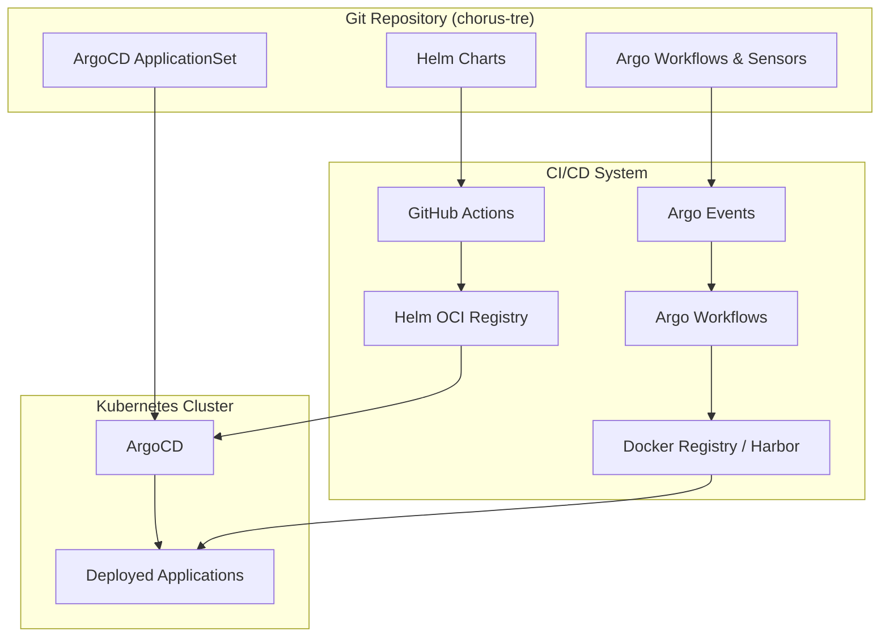
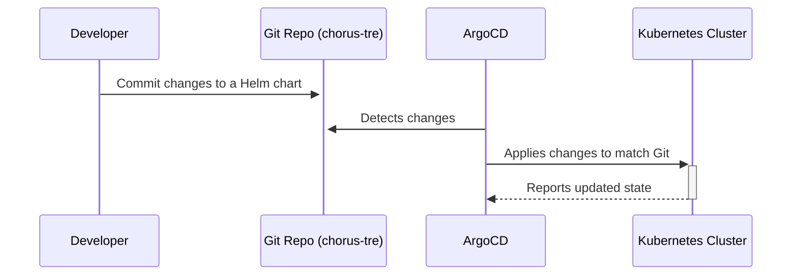
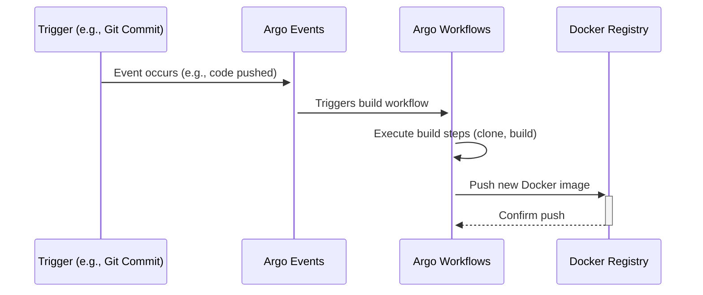

# System Patterns: CHORUS-TRE

This document describes the high-level architecture and core design patterns used in the CHORUS-TRE project. The entire system is designed around GitOps principles, where the Git repository is the single source of truth for both application configurations and deployment workflows.

## 1. High-Level Architecture

The system is composed of two primary automated workflows:
1.  **Application Deployment Workflow**: A GitOps flow where changes to Helm charts in this repository are automatically synchronized to the Kubernetes clusters.
2.  **Image Build Workflow**: A CI/CD flow where Argo Workflows are used to build and publish Docker images for internal applications.

## 2. Application Deployment Pattern (GitOps)

The deployment of applications follows a pure GitOps model, orchestrated by ArgoCD.

1.  **Change Request**: A developer modifies a Helm chart (e.g., bumps a version, changes a value) and commits it to this repository.
2.  **Helm Chart Release (Optional but recommended)**: If the `Chart.yaml` version is bumped, a GitHub Action automatically runs, packages the chart, and pushes it to the CHORUS Helm OCI registry. This is not strictly required for ArgoCD to work, but it is a best practice for versioning.
3.  **ArgoCD Synchronization**: ArgoCD continuously monitors the `charts/` directory in this repository. When it detects a change (either a direct change to the manifests or a version bump that it's configured to track), it pulls the updated chart.
4.  **Deployment**: ArgoCD compares the desired state from the Git repository with the live state in the Kubernetes cluster. It then automatically applies the necessary changes to bring the cluster into the desired state.

## 3. Image Build Pattern

The building of Docker images is handled by Argo Events and Argo Workflows.

1.  **Trigger**: The process is initiated by a trigger, which is configured via an Argo Events `Sensor`. This could be a webhook from a source code repository (e.g., a new commit to a `main` branch of an application's repository) or a manual trigger.
2.  **Workflow Execution**: The `Sensor` triggers an Argo `WorkflowTemplate`. This template defines all the steps required to build the Docker image, such as:
    *   Cloning the application's source code.
    *   Running a `docker build` command.
    *   Pushing the newly created image to a Docker registry (like Harbor).
3.  **Deployment (Indirect)**: Once the new image is pushed, the Application Deployment workflow can be used to deploy it by updating the relevant Helm chart's `values.yaml` to reference the new image tag.

